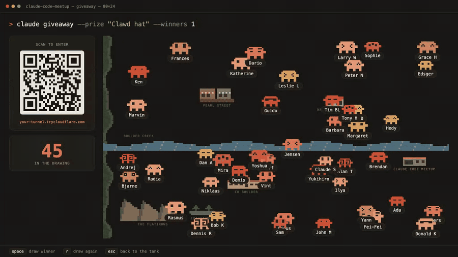

# Claude Raffle

A live giveaway app for meetups. Attendees scan a QR code on the big screen, enter their name, and their phone turns into a controller for their own pixel-art [Clawd](https://www.anthropic.com) wandering around a map of Boulder. When it's time, hit space and a slot machine picks the winner.

Built with Claude Code in a couple of hours for the Boulder Claude Code meetup. Zero dependencies: one Node server, two HTML pages.



## What attendees see

1. Scan the QR on screen, type a name, tap enter.
2. Their Clawd appears on the big screen. The phone becomes a d-pad: tap to step, hold to run.
3. Tap the Clawd on the phone to open a look picker and restyle it. The big screen updates instantly.
4. When the host presses space, the slot machine spins and lands on a winner.

## Run it

Requires Node 22+. For phones to reach the server from anywhere, install [cloudflared](https://developers.cloudflare.com/cloudflare-one/connections/connect-networks/downloads/) (`brew install cloudflared`). No account needed; it uses a free quick tunnel.

```bash
git clone https://github.com/arcorren/claude-raffle.git
cd claude-raffle
npm start
```

Then open **http://localhost:4747/screen** on the laptop and put it on the projector. The QR code points at the tunnel URL.

Without cloudflared, the QR falls back to your LAN IP. That works only if the venue wifi allows device-to-device traffic, which many guest networks block. Test it before the event.

`npm run dev` runs the server alone on localhost, handy for poking at it.

### Screen controls

| Key | Action |
|-----|--------|
| `space` | Draw a winner |
| `r` | Draw again (winner left, or re-roll) |
| `esc` | Close the winner overlay, back to the tank |
| `c` `c` (twice within 1.5s) | Reset all entries |

### Day-of checklist

- Start it once and leave it running. The tunnel URL changes on every restart, so a restart mid-event means everyone re-scans.
- Press `c` twice right before doors open to wipe your test entries.
- The screen page needs internet on the laptop (the QR library loads from a CDN).
- If the tunnel blips, phones show "reconnecting" and recover on their own. Don't restart anything.

## Make it yours

- **Prize name**: search for `Clawd hat` in `public/screen.html` and `public/index.html`.
- **The map**: `buildLandmarks()` in `public/screen.html` draws Boulder. It's a list of labeled pixel-art blobs on a grid, easy to swap for your own town.
- **The critters**: `public/clawd.js` holds the sprite, six body colors, and twelve eye styles. Open `/gallery.html` to see every variant.
- **Winners**: the `--winners 1` on screen is decorative. Press `r` to draw again for a second prize.

## How it works

- `server.js` serves the pages and a small JSON API. Entries persist to `entries.json` so a crash doesn't lose the room.
- Each entry gets a secret token at signup. Moves and look changes require it, so nobody can drive or restyle someone else's critter.
- Draw and reset only accept requests from localhost. Phones can't trigger them.
- The screen page listens on a server-sent events stream. Phones never hold open connections; they poll the entrant count every few seconds. This keeps the free tunnel's connection limits out of the picture at 100+ attendees.
- The winner is picked server-side with `crypto.randomInt`. The slot-machine animation on screen is just for show.
- Names go through a light filter that blocks slurs but leaves crude humor alone. Duplicate names are rejected so the winner callout is unambiguous.

## License

MIT
